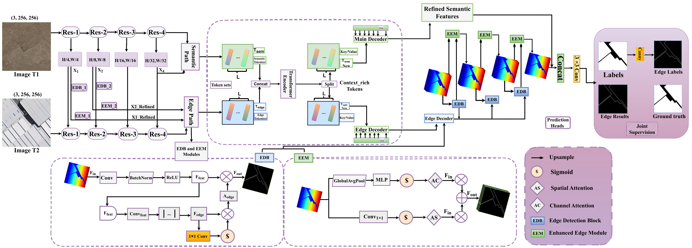

# EdgeRefNet_pytorch

# EdgeRefNet: Edge-Guided Enhancement and Refinement Network for Building Change Detection of Remote Sensing Images
Here, we provide the PyTorch implementation of the paper: EdgeRefNet: Edge-Guided Enhancement and Refinement Network for Building Change Detection of Remote Sensing Images
For more information, please see our paper. 

## Network Architecture


## 1. Environment setup

```
conda create -n edgerefnet python=3.8
conda activate edgerefnet
pip install -r requirements.txt
```
## 2. Dataset Preparation

### Data structure

```
"""
Change detection data set with pixel-level binary labels；(WHU_CD_256 or LEVIR-CD-256)
├─A
├─B
├─label
├─label_edge
└─list
"""
```

`A`: images of t1 phase;

`B`:images of t2 phase;

`label`: label maps;

`label_edge`: using the Canny edge detection operator on theusing the Canny edge detection operator on the label maps;

`list`: contains `train.txt, val.txt, and test.txt`, each file records the image names (XXX.png) in the change detection dataset.


## 3. Download the datasets:
* LEVIR-CD:
[LEVIR-CD](https://pan.baidu.com/s/1gDS6Ea37zfHoZ4832jT9cg?pwd=BUPT)
* WHU-CD:
[WHU-CD](https://github.com/Jnmz/EGENet-IG24/releases/download/1/WHU256.zip)

and put them into the data directory. In addition, the processed whu dataset can be found in the release.

## 4. Download the models (pretrain models):

* [resnet18](https://download.pytorch.org/models/resnet18-5c106cde.pth) 

and put it into the pretrain directory.

## 5. Train & Test
The following are scripts for different networks and datasets, run according to your needs

  
    python main_cd.py --net_G DTCDSCN --project_name DTCDSCN_LEVIR_CD 
    python main_cd.py --net_G DTCDSCN --project_name DTCDSCN_WHU_CD 
    python main_cd.py --net_G SNUNet --project_name SNUNet_LEVIR_CD 
    python main_cd.py --net_G SNUNet --project_name SNUNet_WHU_CD 
    python main_cd.py --net_G BIT --project_name BIT_LEVIR_CD 
    python main_cd.py --net_G BIT --project_name BIT_WHU_CD 
    python main_cd.py --net_G ChangeFormer --project_name ChangeFormer_LEVIR_CD 
    python main_cd.py --net_G ChangeFormer --project_name ChangeFormer_WHU_CD 
    python main_cd.py --net_G EGCTNet --project_name EGCTNet_LEVIR_CD 
    python main_cd.py --net_G EGCTNet --project_name EGCTNet_WHU_CD 
    python main_cd.py --net_G EdgeRefNet --project_name EdgeRefNet_LEVIR_CD 
    python main_cd.py --net_G EdgeRefNet --project_name EdgeRefNet_WHU_CD 
   
   
## References
Appreciate the work from the following repositories:

- [EGENet]([(https://github.com/Jnmz/EGENet-IG24)]) (Our EdgeRefNet is implemented on the code provided in this repository).
